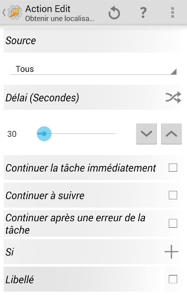
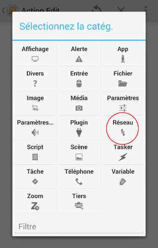
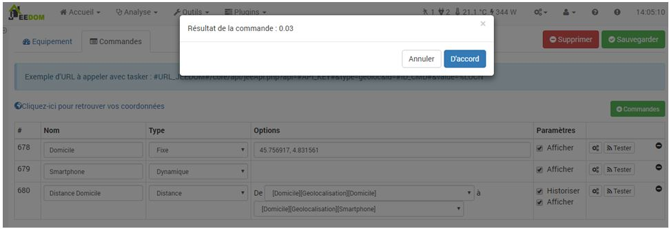

Plugin zur Verwaltung von Koordinaten und Entfernungsberechnung
zwischen 2 Punkten, die Fahrzeit (mit dem Auto) zwischen 2 Punkten sowie
die Entfernung.

Konfiguration 
=============

Sobald das Plugin über den Markt installiert und aktiviert ist, greifen Sie auf das zu
Seite des Geolocation-Plugins von :

Hier finden Sie alle Ihre Geoloc-Geräte :

> **Tip**
>
> Platzieren Sie wie an vielen Stellen in Jeedom die Maus ganz links
> ruft ein Schnellzugriffsmenü auf (Sie können
> von deinem Profil immer sichtbar lassen).

Sobald ein Gerät ausgewählt ist, erhalten Sie :

L'onglet « Général » permet de choisir le nom de l'équipement, l'objet
Eltern sowie deren Zustand und Sichtbarkeit. L'onglet « Commande » permet
um die Informationen hinzuzufügen, die wir erhalten möchten. Einmal
Bei der zusätzlichen Ausstattung haben wir die Wahl zwischen drei Arten von Steuerungen
: fest, dynamisch und distanziert.

Behoben 
----

Stellt einen Punkt mit Koordinaten dar, die sich nicht ändern. Von
Beispiel die Koordinaten Ihres Hauses, Ihrer Arbeit ... Sie
Notieren Sie einfach die Koordinaten im Formular : Breite, Länge.

Um die Koordinaten Ihrer festen Position zu finden, gehen Sie einfach
sur Google map : <https://www.google.com / maps / Vorschau> . Wenn du
Suchen Sie nach einer Adresse, dann befinden sich die Koordinaten in der URL-Adresse,
Zum Beispiel für die 25 rue de Mogador :

Sie können auch mit der linken Maustaste auf die Karte klicken und die
Koordinaten werden in der kleinen Karte oben links angezeigt.

Dynamisch 
---------

Stellt einen Punkt mit variablen Koordinaten dar, das Objekt bewegt sich.
Dies ist normalerweise Ihr Laptop. Dieser Befehl enthält daher
Zuletzt gesendete Kontaktdaten, bis Sie sie senden
Nachrichten. Die URL zum Aktualisieren dieses Befehls lautet :

\#URL\_JEEDOM \# / core / api / jeeApi.php?api=\#API\_KEY\#&type=geoloc&id=\#ID\_CMD\#&value=%LOC

\#URL\_JEEDOM \# entspricht Ihrer Jeedom-Zugriffs-URL. Es ist (außer
wenn Sie mit Ihrem lokalen Netzwerk verbunden sind) von der Internetadresse aus
Sie verwenden, um von außen auf Jeedom zuzugreifen. Vergiss nicht
um den Hafen sowie / jeedom / anzuzeigen.

api = \# API\_KEY \# entspricht Ihrem API-Schlüssel, der für Ihren spezifisch ist
Installation. Um es zu finden, können Sie entweder zum Plugin gehen
Geoloc wird direkt in der URL angegeben.

Soit dans le menu « Général », puis « Administration » et «
Konfiguration », en activant le mode Expert vous verrez alors une ligne
API Schlüssel.

&lt;id=\#ID\_CMD\# correspond à l'ID de votre commande. Einmal
Sie haben Ihrer Geolocation-Bestellung einen Namen gegeben, der bestimmt wurde
son type et sauvegardé, un numéro apparaît dans la case « \# » devant le
Nennen Sie Ihre Bestellung.

% LOC entspricht Ihren Koordinaten in der Form Latitude, Longitude.

Sie müssen daher einen HTTP-POST für diese Adresse durchführen, indem Sie sie ersetzen
% LOC anhand Ihrer Kontaktdaten.

Android Beispiel mit Tasker 
=============

Achtung : Für dieses Beispiel benötigen Sie die Tasker-App
für Android
(<https://play.google.com/store/apps/details?id = net.dinglisch.android.taskerm>).
Dans l'onglet « Tâches », nous rajoutons une nouvelle tâche ici appelée
« Jeedom ».

Nous y ajoutons une première action, dans la catégorie « Divers », nous
sélectionnons « Obtenir la localisation ».

Wir werden jede Quelle verwenden, um unsere zu erhalten
Position, und wir werden eine Verzögerung von 30 Sekunden einstellen, damit Tasker die hat
Zeit, unsere Kontaktdaten zu erhalten.

Ein zu kurzer Zeitrahmen enthält möglicherweise keine Kontaktdaten
oder ungenaue Koordinaten. Gleiches gilt für die Art von
source. Nous ajoutons une deuxième action, dans la partie « Réseau »
cette fois, nous sélectionnons « Post HTTP ».

Dans la case « Serveur :Port » nous copions notre URL complétée sauf
für den% LOC-Teil.

Lorsque nous lançons notre tâche « Jeedom », une icône devrait vous
Informieren Sie in Ihrer Benachrichtigungsleiste über die Verwendung Ihres GPS.

Einmal le délai écoulé, nous cliquons sur « tester » dans Jeedom et
Die Koordinaten unseres Handys werden dann im Popup angezeigt.
Der Tasker hat die Variable% LOC automatisch durch Ihre Kontaktdaten ersetzt.

Jetzt müssen Sie nur noch ein Szenario in Tasker erstellen, das gestartet wird
diese Aufgabe, wenn Sie es brauchen. Zum Beispiel jede Stunde,
wenn Sie eine Verbindung über WLAN herstellen…

Entfernung, Reisezeit und Reisestrecke 
=============

Berechnen Sie die Entfernung, die Fahrzeit (mit dem Auto, mit
von Google Maps) oder die Reisedistanz (mit dem Auto, mit
Google Maps) zwischen zwei Punkten. Es ist daher notwendig, bereits zu haben
mindestens zwei Bestellungen ausgeführt. Hier haben wir die festen Koordinaten
unseres Hauses sowie die aktualisierten Kontaktdaten unserer
tragbar. So können wir den Abstand zwischen den beiden berechnen. Wir
sélectionnons « Distance » en type et nos deux commandes précédentes
in Optionen. Nach dem Speichern verwenden wir die Testschaltfläche
und die Entfernung wird dann im Popup angezeigt. Hier 1,34 km.

Ebenso, wenn Sie die Reisezeit oder die Entfernung einer Reise wollen, es
muss jeweils in Typ wählen : "Reisezeit "oder" Entfernung
Reise".

Dieses Plugin arbeitet als Modul, d. H. Einmal
gespeichert finden wir es in der Liste der Aktionen oder
Befehle, so ist es sehr einfach beim Erstellen zu verwenden
Szenarien zum Beispiel. Wir können zum Beispiel ein Szenario durchführen, das
Zum Beispiel basierend auf der Entfernung zwischen unserem Laptop und dem Haus.

Beispielszenario 
=============

Dans la partie « Scénario », nous créons un scénario nommé « Géoloc TV »
Dadurch können wir den Fernseher einschalten, wenn wir weniger als 250 m von uns entfernt sind
unser Haus. Achtung : Positionierungssysteme nicht
Denken Sie daran, beim Erstellen einen Rand zu berücksichtigen, der auf den nächsten Meter genau ist
Ihre Szenarien. Dans « Mode de scénario » nous choisissons « Provoqué »
et en « Déclencheur » nous ajoutons notre portable. In der Tat ist es
wann die Koordinaten unseres Handys aktualisiert werden
Wir werden das Szenario auslösen.

Nous ajoutons un élément « Si / Alors / Sinon » avec comme condition une
Entfernung weniger als 250 m und als Aktion das Einschalten der
TV.

Nous n'avons rien mis dans la partie « Sinon » ainsi il ne se passera
nichts, wenn ich mehr als 250 m entfernt bin. Einmal gespeichert, können wir
Schau dir das Protokoll an. Wir sehen hier, dass Jeedom den Abstand zwischen dem getestet hat
tragbar und zuhause und so ist es mehr als 250 m, dann da
nichts ist passiert.

Für unseren Test prüfen wir, ob der Fernseher ausgeschaltet ist
Widget zeigt 0 Watt Verbrauch an.

Wir nähern uns unserem Haus und beginnen die Aufgabe am
Tasker. Wir können sehen, indem wir die Entfernung testen, die es ist
Jetzt 0,03 km. Wir sind also weit unter 250 m.

Der Szenarioteil informiert uns darüber, dass er gestartet wurde
in letzter Zeit.

Durch einen Rundgang durch das Protokoll können wir sehen, dass es gestartet wurde
nach der Aktualisierung der Koordinaten des Mobiltelefons, und dass die Entfernung
war viel weniger als 0,25 km.

Das TV-Plugin auf dem Startbildschirm zeigt an, dass dies der Fall ist
jetzt mit Strom versorgt.

Hier ist ein Beispiel für die Verwendung des Geolocation-Plugins.

Natürlich haben wir den HTTP POST von einem Smartphone unter realisiert
Android ist aber durchaus denkbar, dass ein Tablet könnte
Machen Sie dasselbe (mit Internet) oder sogar einen Laptop mit einem
Skript zum Abrufen und Senden von Kontaktdaten.
