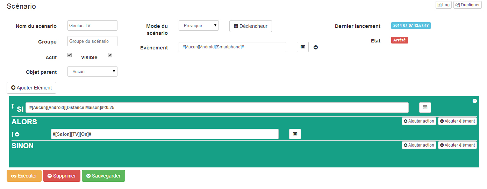

.

Konfiguration 
=============

Sobald das Plugin über den Markt installiert und aktiviert ist, greifen Sie auf das zu
 :

 :

> **Spitze**
>
> Platzieren Sie wie an vielen Stellen in Jeedom die Maus ganz links
> ruft ein Schnellzugriffsmenü auf (Sie können
> von deinem Profil immer sichtbar lassen).

Sobald ein Gerät ausgewählt ist, erhalten Sie :

L'onglet « Général » permet de choisir le nom de l'équipement, l'objet
. L'onglet « Commande » permet
. 

: .

 
----

 : .

 : <https:.> . Wenn du
,
 :

.

 
---------

.
. 

 :

?api=\#API\_KEY\#&type=geoloc&id=\#ID\_CMD\#&value=%LOC

. 

. 
.

.

Soit dans le menu « Général », puis « Administration » et «
Konfiguration », en activant le mode Expert vous verrez alors une ligne
API Schlüssel.

&lt;id=\#ID\_CMD\# correspond à l'ID de votre commande. 

son type et sauvegardé, un numéro apparaît dans la case « \# » devant le
.

.

.

 
=============

Achtung : 

:?.
Dans l'onglet « Tâches », nous rajoutons une nouvelle tâche ici appelée
« Jeedom ».

Nous y ajoutons une première action, dans la catégorie « Divers », nous
sélectionnons « Obtenir la localisation ».

.

. 
source. Nous ajoutons une deuxième action, dans la partie « Réseau »
cette fois, nous sélectionnons « Post HTTP ».

Dans la case « Serveur :Port » nous copions notre URL complétée sauf
.

Lorsque nous lançons notre tâche « Jeedom », une icône devrait vous
.

 le délai écoulé, nous cliquons sur « tester » dans Jeedom et
.
.

. ,

 
=============

. 
. 

sélectionnons « Distance » en type et nos deux commandes précédentes
. 
. .

 : "
".

. 
.

 
=============

Dans la partie « Scénario », nous créons un scénario nommé « Géoloc  »

. Achtung : 

. Dans « Mode de scénario » nous choisissons « Provoqué »
et en « Déclencheur » nous ajoutons notre portable. 

.

Nous ajoutons un élément « Si / Alors / Sinon » avec comme condition une

.

Nous n'avons rien mis dans la partie « Sinon » ainsi il ne se passera
. 
. 

.

.

. .

.

.

.

.

.
