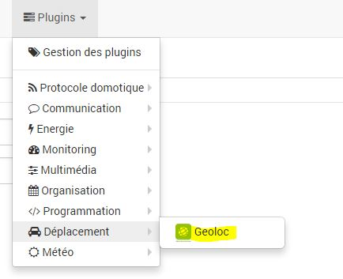
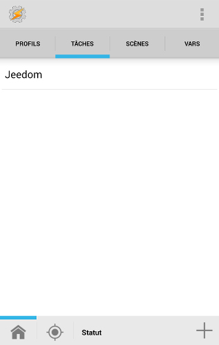
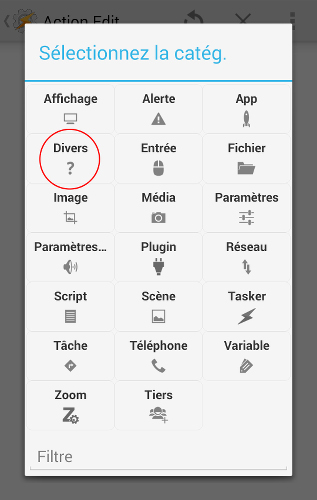
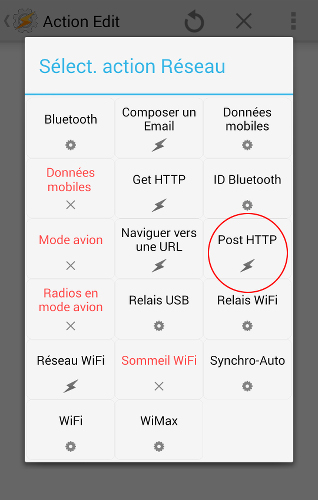
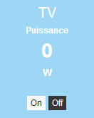

# Complemento Geoloc

Complemento para administrar coordenadas y calcular la distancia entre 2 puntos, el tiempo de viaje (en automóvil) entre 2 puntos y la distancia.

# Configuration

Una vez que el complemento está instalado y activado desde Market, puede acceder a la página del complemento Geolocalización :

Aquí encontrarás todos tus equipos Geoloc :

> **Tip**
>
> Como en muchos lugares de Jeedom, colocar el mouse en el extremo izquierdo permite que aparezca un menú de acceso rápido (siempre puede dejarlo visible desde su perfil).

Una vez que se selecciona un equipo, obtienes :

L'onglet « Général » permet de choisir le nom de l'équipement, l'objet parent ainsi que son état et sa visibilité. L'onglet « Commande » permet de rajouter les informations que nous voulons obtenir. Una vez que se ha agregado el equipo, tenemos la opción de elegir entre tres tipos de controles. : fijo, dinámico y distancia.

## Fixe

Representa un punto con coordenadas que no cambian.. Por ejemplo, las coordenadas de su hogar, su trabajo ... Solo tiene que anotar las coordenadas en el formulario : Latitud longitud.

Pour trouver les coordonnées de votre position fixe, allez simplement sur Google map : <https://www.google.com / maps / preview> . Si está buscando una dirección, los datos de contacto estarán en la dirección URL, por ejemplo, 25 rue de Mogador :

También puede hacer clic izquierdo en el mapa, y las coordenadas aparecerán en el pequeño mapa en la parte superior izquierda.

## Dynamique

Representa un punto con coordenadas variables, el objeto se mueve. Esta suele ser tu computadora portátil. Por lo tanto, este pedido contendrá los últimos detalles de contacto enviados hasta que envíe otros nuevos.. La URL para actualizar este comando es :

``\#URL\_JEEDOM\#/core/api/jeeApi.php?api=\#API\_KEY\#&type=geoloc&id=\#ID\_CMD\#&value=%LOC``

\#URL\_JEEDOM\# corresponde a su URL de acceso de Jeedom. Esta es (a menos que esté conectado a su red local) la dirección de Internet que utiliza para acceder a Jeedom desde afuera. No olvides indicar el puerto así como / jeedom /.

api=\#API\_KEY\# corresponde a su clave API, específica a su instalación. Para encontrarlo, puede ir al complemento Géoloc, que se indica directamente en la URL.

Soit dans le menu « Général », puis « Administration » et « Configuración », en activant le mode Expert vous verrez alors une ligne clé API.

&lt;id=\#ID\_CMD\# corresponde a la identificación de su pedido. Une fois que vous avez donné un nom à votre commande de Géolocalisation, déterminé son type et sauvegardé, un numéro apparaît dans la case « \# » devant le nom votre commande.

``%LOC`` corresponde a sus coordenadas en la forma Latitud, Longitud.

Por lo tanto, debe realizar una POST HTTP en esta dirección reemplazando% LOC con sus datos de contacto.

# Ejemplo de Android con Tasker

Atención : para este ejemplo necesitas la aplicación Tasker para Android
(<https://play.google.com/store/apps/details?id=net.dinglisch.android.taskerm>). Dans l'onglet « Tâches », nous rajoutons une nouvelle tâche ici appelée « Jeedom ».

Nous y ajoutons une première action, dans la catégorie « Divers », nous sélectionnons « Obtenir la localisation ».

Utilizaremos cualquier fuente para obtener nuestra posición, y estableceremos un límite de tiempo de 30 segundos para que Tasker tenga
hora de obtener nuestros datos de contacto.

Un período de tiempo demasiado corto puede no permitir obtener detalles de contacto o detalles de contacto inexactos. Es lo mismo para el tipo de fuente.. Nous ajoutons une deuxième action, dans la partie « Réseau » cette fois, nous sélectionnons « Post HTTP ».

Dans la case « Serveur :Port » nous copions notre URL complétée sauf pour la partie %LOC.

Lorsque nous lançons notre tâche « Jeedom », une icône devrait vous informer de l'utilisation de votre GPS dans votre barre de notification.

Une fois le délai écoulé, nous cliquons sur « tester » dans Jeedom et les coordonnées de notre portable apparaissent alors dans le popup. Tasker reemplazó automáticamente la variable% LOC con sus datos de contacto.

Ahora solo necesita crear un escenario en Tasker que inicie esta tarea cuando la necesite.. Por ejemplo, cada hora, cuando te conectas por wifi ...

# Distancia, tiempo de viaje y distancia de viaje

Calcula la distancia, el tiempo de viaje (en automóvil, usando Google Maps) o la distancia de un viaje (en automóvil, usando Google Maps) entre dos puntos. Por lo tanto, es necesario haber completado al menos dos comandos. Aquí tenemos las coordenadas fijas de nuestra casa, así como las coordenadas actualizadas de nuestro móvil.. Entonces podemos calcular la distancia entre los dos. Nous sélectionnons « Distance » en type et nos deux commandes précédentes dans les options. Una vez guardado, usamos el botón de prueba y la distancia aparece en la ventana emergente. Aquí 1.34 km.

Del mismo modo, si desea el tiempo de viaje o la distancia de un viaje,
debe elegir respectivamente en tipo : "Tiempo de viaje "o" Distancia
viaje".

Este complemento funciona como un módulo, es decir, una vez guardado podemos encontrarlo en la lista de acciones o comandos, por lo tanto, es muy simple usarlo al crear escenarios, por ejemplo. Por ejemplo, podemos llevar a cabo un escenario que se basa en la distancia entre nuestra computadora portátil y la casa, por ejemplo.

# Escenario de ejemplo

Dans la partie « Scénario », nous créons un scénario nommé « Géoloc TV » qui nous permet d'allumer la TV quand nous sommes à moins de 250 m de notre maison. Atención : los sistemas de posicionamiento no son precisos al metro más cercano, recuerde tomar un margen al crear sus escenarios. Dans « Mode de scénario » nous choisissons « Provoqué » et en « Déclencheur » nous ajoutons notre portable. De hecho, es cuando las coordenadas de nuestro teléfono móvil se actualizarán que desencadenaremos el escenario.

Nous ajoutons un élément « Si / Alors / Sinon » avec comme condition une distance inférieure à 250 m et comme action la mise sous tension de la TV.

Nous n'avons rien mis dans la partie « Sinon » ainsi il ne se passera rien si je suis à plus de 250 m. Una vez guardado, podemos mirar el registro. Vemos aquí que Jeedom ha probado la distancia entre la computadora portátil y la casa y dado que esta última tiene más de 250 m, entonces no pasó nada.

Para nuestra prueba, comprobamos que el televisor está apagado, el widget nos muestra un consumo de 0 vatios.

Nos acercamos a nuestra casa y comenzamos la tarea en Tasker. Podemos ver probando la distancia que ahora es 0.03 km. Entonces estamos muy por debajo de los 250 m.

La parte del escenario nos informa que se lanzó recientemente.

Un recorrido en el registro nos permite ver que se lanzó después de actualizar las coordenadas del teléfono móvil, y que la distancia era mucho menor que 0.25 km.

El complemento de TV en la pantalla de inicio muestra que ahora está alimentado.

Aquí hay un ejemplo del uso del complemento de geolocalización.

Por supuesto, hicimos la POST HTTP desde un teléfono inteligente Android, pero es bastante concebible que una tableta pueda hacer lo mismo (con Internet) o incluso una computadora portátil con un script para recuperar y enviar sus detalles.
