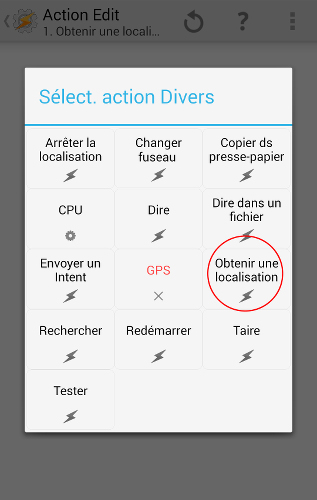
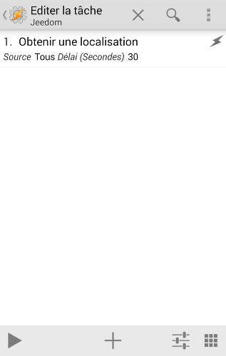
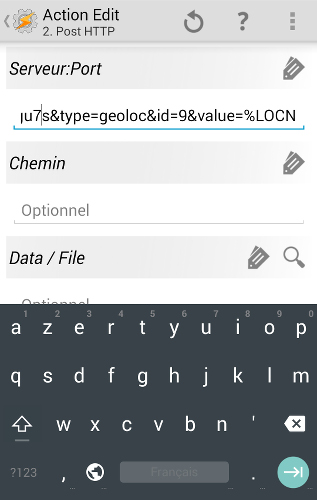
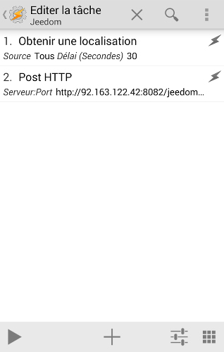
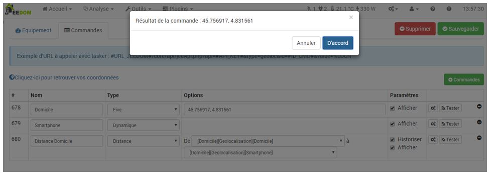
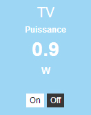

Complemento para gestionar coordenadas y cálculo de distancia
entre 2 puntos, el tiempo de viaje (en coche) entre 2 puntos, así como
la distancia.

Configuración 
=============

Una vez que el complemento está instalado y activado desde Market, accede a
página del complemento Geolocalización por :

Aquí encontrarás todos tus equipos Geoloc :

> **Tip**
>
> Como en muchos lugares de Jeedom, coloca el mouse en el extremo izquierdo
> abre un menú de acceso rápido (puedes
> desde tu perfil siempre déjalo visible).

Una vez que se selecciona un equipo, obtienes :

L'onglet « Général » permet de choisir le nom de l'équipement, l'objet
padre, así como su condición y visibilidad. L'onglet « Commande » permet
para agregar la información que queremos obtener. Una vez
el equipo agregado, tenemos la opción entre tres tipos de controles
: fijo, dinámico y distancia.

Arreglado 
----

Representa un punto con coordenadas que no cambian. Por
ejemplo las coordenadas de su hogar, su trabajo ... es usted
solo tenga en cuenta las coordenadas en el formulario : Latitud longitud.

Para encontrar las coordenadas de su posición fija, simplemente vaya
sur Google map : <https://www.google.com / maps / preview> . Si usted
buscar una dirección, entonces las coordenadas estarán en la dirección URL,
por ejemplo para 25 rue de Mogador :

También puede hacer clic izquierdo en el mapa, y el
las coordenadas aparecerán en el pequeño mapa en la esquina superior izquierda.

Dinámico 
---------

Representa un punto con coordenadas variables, el objeto se mueve.
Esta suele ser tu computadora portátil. Este comando por lo tanto contendrá
últimos datos de contacto enviados hasta que los envíe
noticias La URL para actualizar este comando es :

\#URL\_JEEDOM \# / core / api / jeeApi.php?api=\#API\_KEY\#&type=geoloc&id=\#ID\_CMD\#&value=%LOC

\#URL\_JEEDOM \# corresponde a su URL de acceso de Jeedom. Es (excepto
si está conectado a su red local) desde la dirección de internet que
utilizas para acceder a Jeedom desde afuera. No olvides
para indicar el puerto, así como / jeedom /.

api = \# API\_KEY \# corresponde a su clave API, específica a su
instalación Para encontrarlo, puedes ir al complemento
Geoloc, se indica directamente en la URL.

Soit dans le menu « Général », puis « Administration » et «
Configuración », en activant le mode Expert vous verrez alors une ligne
Clave API.

&lt;id=\#ID\_CMD\# correspond à l'ID de votre commande. Una vez que
ha dado un nombre a su pedido de Geolocalización, determinado
son type et sauvegardé, un numéro apparaît dans la case « \# » devant le
nombra tu pedido.

% LOC corresponde a sus coordenadas en la forma Latitud, Longitud.

Por lo tanto, debe realizar una POST HTTP en esta dirección reemplazando
% LOC por sus datos de contacto.

Ejemplo de Android con Tasker 
=============

Atención : para este ejemplo necesitas la aplicación Tasker
para Android
(<https://play.google.com/store/apps/details?id = net.dinglisch.android.taskerm>).
Dans l'onglet « Tâches », nous rajoutons une nouvelle tâche ici appelée
« Jeedom ».

Nous y ajoutons une première action, dans la catégorie « Divers », nous
sélectionnons « Obtenir la localisation ».

Utilizaremos cualquier fuente para obtener nuestro
posición, y vamos a establecer un retraso de 30 segundos para que Tasker tenga
hora de obtener nuestros datos de contacto.

Un período de tiempo demasiado corto puede no proporcionar detalles de contacto
o coordenadas imprecisas. Lo mismo es cierto para el tipo de
source. Nous ajoutons une deuxième action, dans la partie « Réseau »
cette fois, nous sélectionnons « Post HTTP ».

Dans la case « Serveur :Port » nous copions notre URL complétée sauf
para la parte% LOC.

Lorsque nous lançons notre tâche « Jeedom », une icône devrait vous
informar sobre el uso de su GPS en su barra de notificaciones.

Una vez le délai écoulé, nous cliquons sur « tester » dans Jeedom et
las coordenadas de nuestro teléfono celular luego aparecen en la ventana emergente.
Tasker reemplazó automáticamente la variable% LOC con sus datos de contacto.

Ahora solo necesita crear un escenario en Tasker que se lanzará
esta tarea cuando la necesitas. Por ejemplo cada hora,
cuando te conectas por wifi ...

Distancia, tiempo de viaje y distancia de viaje 
=============

Calcule la distancia, el tiempo de viaje (en automóvil, usando
desde Google Maps) o la distancia de viaje (en automóvil, usando
Google Maps) entre dos puntos. Por lo tanto, es necesario tener ya
completado al menos dos pedidos. Aquí tenemos las coordenadas fijas.
de nuestra casa, así como los datos de contacto actualizados de nuestro
portátil Entonces podemos calcular la distancia entre los dos. Nosotros
sélectionnons « Distance » en type et nos deux commandes précédentes
en opciones. Una vez guardado, usamos el botón de prueba
y la distancia aparece en la ventana emergente. Aquí 1.34 km.

Del mismo modo, si desea el tiempo de viaje o la distancia de un viaje,
debe elegir respectivamente en tipo : "Tiempo de viaje "o" Distancia
viaje".

Este complemento funciona como un módulo, es decir, una vez
guardado podemos encontrarlo en la lista de acciones o
comandos, por lo que es muy fácil de usar al crear
escenarios por ejemplo. Podemos, por ejemplo, llevar a cabo un escenario que
basado en la distancia entre nuestra computadora portátil y la casa, por ejemplo.

Escenario de ejemplo 
=============

Dans la partie « Scénario », nous créons un scénario nommé « Géoloc TV »
lo que nos permite encender el televisor cuando estamos a menos de 250 m de
nuestra casa. Atención : sistemas de posicionamiento no siendo
precisa al metro más cercano, recuerde tomar un margen al crear
tus escenarios. Dans « Mode de scénario » nous choisissons « Provoqué »
et en « Déclencheur » nous ajoutons notre portable. De hecho, es
cuando se actualizarán las coordenadas de nuestro teléfono celular que
desencadenaremos el escenario.

Nous ajoutons un élément « Si / Alors / Sinon » avec comme condition une
distancia inferior a 250 my como acción el encendido del
TV.

Nous n'avons rien mis dans la partie « Sinon » ainsi il ne se passera
nada si estoy a más de 250 m. Una vez guardado, podemos
mira el registro. Vemos aquí que Jeedom ha probado la distancia entre
portátil y hogar y así es más de 250 m, entonces hay
no paso nada.

Para nuestra prueba, comprobamos que el televisor está apagado, el
el widget muestra el consumo de 0 vatios.

Nos acercamos a nuestra casa y comenzamos la tarea en
Tasker Podemos ver probando la distancia que es
0.03 km ahora. Entonces estamos muy por debajo de los 250 m.

La parte del escenario nos informa que se ha lanzado
ultimamente.

Un recorrido por el registro nos permite ver que se ha lanzado.
siguiendo la actualización de las coordenadas del móvil, y que la distancia
fue mucho menos de 0.25 km.

El complemento de TV en la pantalla de inicio muestra que es
ahora alimentado.

Aquí hay un ejemplo del uso del complemento de geolocalización.

Por supuesto, nos dimos cuenta de HTTP POST desde un teléfono inteligente bajo
Android, pero es totalmente concebible que una tableta pueda
hacer lo mismo (con internet) o incluso una computadora portátil con
guión para recuperar y enviar datos de contacto.
