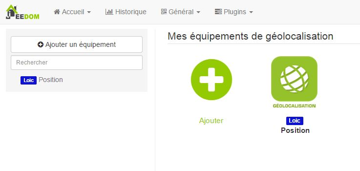
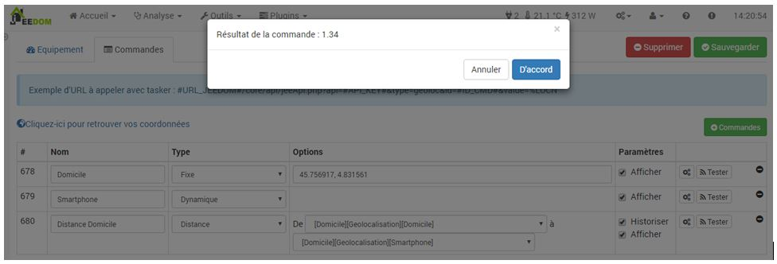

Plugin para gerenciar coordenadas e cálculo de distância
entre 2 pontos, o tempo de viagem (de carro) entre 2 pontos, bem como
a distância.

Configuração 
=============

Depois que o plug-in é instalado e ativado no Market, você acessa o
página do plug-in Geolocalização por :

Aqui você encontra todo o seu equipamento Geoloc :

> **Tip**
>
> Como em muitos lugares em Jeedom, coloque o mouse na extremidade esquerda
> abre um menu de acesso rápido (você pode
> do seu perfil, deixe-o sempre visível).

Depois que um equipamento é selecionado, você obtém :

L'onglet « Général » permet de choisir le nom de l'équipement, l'objet
pai, bem como sua condição e visibilidade. L'onglet « Commande » permet
para adicionar as informações que queremos obter. Uma vez
o equipamento adicionado, temos a escolha entre três tipos de controles
: fixo, dinâmico e à distância.

Fixed 
----

Representa um ponto com coordenadas que não são alteradas. Por
exemplo as coordenadas de sua casa, seu trabalho ... É você
basta observar as coordenadas no formulário : Latitude, Longitude.

Para encontrar as coordenadas da sua posição fixa, basta ir
sur Google map : <https://www.google.com / maps / preview> . Se você
procurar um endereço, as coordenadas estarão no endereço URL,
por exemplo, para 25 rue de Mogador :

Você também pode clicar com o botão esquerdo no mapa e o
as coordenadas aparecerão no pequeno mapa no canto superior esquerdo.

Dinâmico 
---------

Representa um ponto com coordenadas variáveis, o objeto se move.
Este é geralmente o seu laptop. Este comando conterá, portanto,
últimos detalhes de contato enviados até você enviá-los
notícias. O URL para atualizar este comando é :

\#URL\_JEEDOM \# / core / api / jeeApi.php?api=\#API\_KEY\#&type=geoloc&id=\#ID\_CMD\#&value=%LOC

\#URL\_JEEDOM \# corresponde ao seu URL de acesso Jeedom. É (exceto
se você estiver conectado à sua rede local) a partir do endereço de Internet que
você usa para acessar o Jeedom de fora. Não esqueça
para indicar a porta e / jeedom /.

api = \# API\_KEY \# corresponde à sua chave de API, específica à sua
instalação. Para encontrá-lo, você pode ir ao plugin
Geoloc, é indicado diretamente no URL.

Soit dans le menu « Général », puis « Administration » et «
Configuração », en activant le mode Expert vous verrez alors une ligne
Chave de API.

&lt;id=\#ID\_CMD\# correspond à l'ID de votre commande. Uma vez
você deu um nome ao seu pedido de geolocalização, determinado
son type et sauvegardé, un numéro apparaît dans la case « \# » devant le
nomeie seu pedido.

% LOC corresponde às suas coordenadas no formato Latitude, Longitude.

Portanto, você deve executar um HTTP POST neste endereço substituindo
% LOC por seus detalhes de contato.

Exemplo Android com Tasker 
=============

Atenção : para este exemplo, você precisa do aplicativo Tasker
para Android
(<https://play.google.com/store/apps/details?id = net.dinglisch.android.taskerm>).
Dans l'onglet « Tâches », nous rajoutons une nouvelle tâche ici appelée
« Jeedom ».

Nous y ajoutons une première action, dans la catégorie « Divers », nous
sélectionnons « Obtenir la localisation ».

Usaremos qualquer fonte para obter nossa
posição, e vamos definir um atraso de 30 segundos para que Tasker tenha o
hora de obter nossos detalhes de contato.

Um período de tempo muito curto pode não permitir a obtenção de detalhes de contato
ou coordenadas imprecisas. O mesmo se aplica ao tipo de
source. Nous ajoutons une deuxième action, dans la partie « Réseau »
cette fois, nous sélectionnons « Post HTTP ».

Dans la case « Serveur :Port » nous copions notre URL complétée sauf
para a parte% LOC.

Lorsque nous lançons notre tâche « Jeedom », une icône devrait vous
informe sobre o uso do seu GPS na sua barra de notificação.

Uma vez le délai écoulé, nous cliquons sur « tester » dans Jeedom et
as coordenadas do nosso telefone celular aparecem no pop-up.
O Tasker substituiu automaticamente a variável% LOC pelos seus detalhes de contato.

Agora você só precisa criar um cenário no Tasker que iniciará
esta tarefa quando você precisar. Por exemplo, a cada hora,
quando você se conecta via wifi…

Distância, Tempo de Viagem e Distância de Viagem 
=============

Calcule a distância, o tempo de viagem (de carro, usando
Google Maps) ou a distância da viagem (de carro, usando
Google Maps) entre dois pontos. Portanto, é necessário ter já
atendeu pelo menos dois pedidos. Aqui temos as coordenadas fixas
da nossa casa, bem como os detalhes de contato atualizados do nosso
portátil. Para que possamos calcular a distância entre os dois. Nós
sélectionnons « Distance » en type et nos deux commandes précédentes
em opções. Depois de salvos, usamos o botão de teste
e a distância aparece no pop-up. Aqui 1.34 km.

Da mesma forma, se você deseja o tempo ou a distância de uma jornada,
deve escolher respectivamente no tipo : "Tempo de viagem "ou" Distância
viagem".

Este plug-in funciona como um módulo, ou seja, uma vez
salvo, podemos encontrá-lo na lista de ações ou
comandos, por isso é muito fácil de usar ao criar
cenários por exemplo. Podemos, por exemplo, realizar um cenário que
com base na distância entre o laptop e a casa, por exemplo.

Cenário de exemplo 
=============

Dans la partie « Scénario », nous créons un scénario nommé « Géoloc TV »
o que nos permite ligar a TV quando estamos a menos de 250 m de
nossa casa. Atenção : sistemas de posicionamento não sendo
preciso ao medidor mais próximo, lembre-se de ter uma margem ao criar
seus cenários. Dans « Mode de scénario » nous choisissons « Provoqué »
et en « Déclencheur » nous ajoutons notre portable. De fato, é
quando as coordenadas do nosso celular serão atualizadas
vamos desencadear o cenário.

Nous ajoutons un élément « Si / Alors / Sinon » avec comme condition une
distância inferior a 250 me como ação a energização do
TV.

Nous n'avons rien mis dans la partie « Sinon » ainsi il ne se passera
nada se estiver a mais de 250 m. Uma vez salvos, podemos
olhe para o log. Vemos aqui que Jeedom testou a distância entre o
portátil e em casa e assim tem mais de 250 m, então há
nada aconteceu.

Para o nosso teste, verificamos que a TV está desligada, o
o widget exibe 0 consumo de watt.

Nós nos aproximamos de nossa casa e começamos a tarefa em
Tasker. Podemos ver testando a distância que é
0,03 km agora. Então, estamos bem abaixo dos 250 m.

A parte do cenário nos informa que foi lançada
ultimamente.

Um tour pelo log nos permite ver que ele foi lançado
após a atualização das coordenadas do celular, e que a distância
era muito menos que 0,25 km.

O plug-in da TV na tela inicial mostra que é
agora alimentado.

Aqui está um exemplo de uso do plug-in de geolocalização.

Obviamente, percebemos o HTTP POST de um smartphone sob
Android, mas é inteiramente concebível que um tablet possa
faça a mesma coisa (com internet) ou até mesmo um laptop com
script para recuperar e enviar detalhes de contato.
